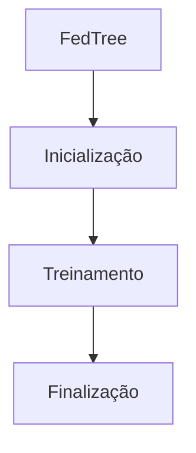

00-overview

Visão mais alta do FedTree. Este diagrama só mostra o encadeamento geral do sistema.

```mermaid
flowchart TD
    A[FedTree] --> B[Inicialização]
    B --> C[Treinamento]
    C --> D[Finalização]
```

