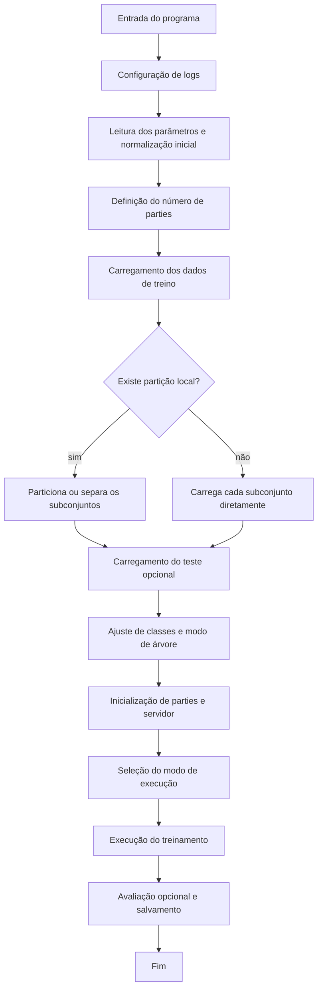

01-train-main

Fluxo do executável `FedTree-train`, limitado ao que acontece no `main`.

```mermaid
flowchart TD
    A[Entrada do programa] --> B[Configuração de logs]
    B --> C[Leitura dos parâmetros e normalização inicial]
    C --> D[Definição do número de parties]
    D --> E[Carregamento dos dados de treino]
    E --> F{Existe partição local?}
    F -->|sim| G[Particiona ou separa os subconjuntos]
    F -->|não| H[Carrega cada subconjunto diretamente]
    G --> I[Carregamento do teste opcional]
    H --> I
    I --> J[Ajuste de classes e modo de árvore]
    J --> K[Inicialização de parties e servidor]
    K --> L[Seleção do modo de execução]
    L --> M[Execução do treinamento]
    M --> N[Avaliação opcional e salvamento]
    N --> O[Fim]
```

