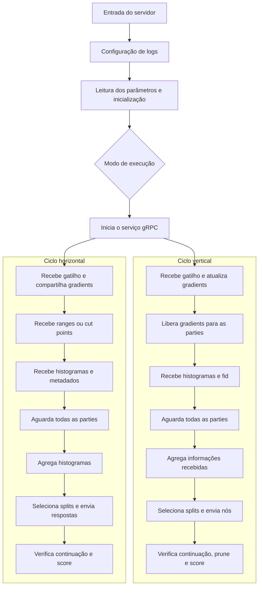

02-distributed-server

Fluxo interno do servidor distribuído. O objetivo aqui é mostrar o papel do servidor como ponto de coordenação do protocolo.

```mermaid
flowchart TD
    A[Entrada do servidor] --> B[Configuração de logs]
    B --> C[Leitura dos parâmetros e inicialização]
    C --> D{Modo de execução}
    D --> S[Inicia o serviço gRPC]

    subgraph "Ciclo vertical"
        V2[Recebe gatilho e atualiza gradients] --> V3[Libera gradients para as parties]
        V3 --> V4[Recebe histogramas e fid]
        V4 --> V5[Aguarda todas as parties]
        V5 --> V6[Agrega informações recebidas]
        V6 --> V7[Seleciona splits e envia nós]
        V7 --> V8[Verifica continuação, prune e score]
    end

    subgraph "Ciclo horizontal"
        H2[Recebe gatilho e compartilha gradients] --> H3[Recebe ranges ou cut points]
        H3 --> H4[Recebe histogramas e metadados]
        H4 --> H5[Aguarda todas as parties]
        H5 --> H6[Agrega histogramas]
        H6 --> H7[Seleciona splits e envia respostas]
        H7 --> H8[Verifica continuação e score]
    end

    S --> V2
    S --> H2
```

