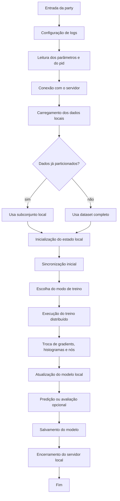

03-distributed-party

Fluxo interno de uma party/cliente distribuído. O foco é a participação da party no protocolo federado.

```mermaid
flowchart TD
    A[Entrada da party] --> B[Configuração de logs]
    B --> C[Leitura dos parâmetros e do pid]
    C --> D[Conexão com o servidor]
    D --> E[Carregamento dos dados locais]
    E --> F{Dados já particionados?}
    F -->|sim| G[Usa subconjunto local]
    F -->|não| H[Usa dataset completo]
    G --> I[Inicialização do estado local]
    H --> I
    I --> J[Sincronização inicial]
    J --> K[Escolha do modo de treino]
    K --> L[Execução do treino distribuído]
    L --> M[Troca de gradients, histogramas e nós]
    M --> N[Atualização do modelo local]
    N --> O[Predição ou avaliação opcional]
    O --> P[Salvamento do modelo]
    P --> Q[Encerramento do servidor local]
    Q --> R[Fim]
```

