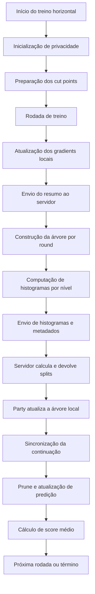

04-horizontal-training

Fluxo do treinamento horizontal em nível de protocolo. O diagrama mostra a rodada principal de comunicação e atualização.

```mermaid
flowchart TD
    A[Início do treino horizontal] --> B[Inicialização de privacidade]
    B --> C[Preparação dos cut points]
    C --> D[Rodada de treino]
    D --> E[Atualização dos gradients locais]
    E --> F[Envio do resumo ao servidor]
    F --> G[Construção da árvore por round]
    G --> H[Computação de histogramas por nível]
    H --> I[Envio de histogramas e metadados]
    I --> J[Servidor calcula e devolve splits]
    J --> K[Party atualiza a árvore local]
    K --> L[Sincronização da continuação]
    L --> M[Prune e atualização de predição]
    M --> N[Cálculo de score médio]
    N --> O[Próxima rodada ou término]
```

