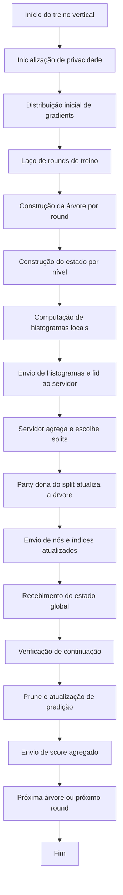

05-vertical-training

Fluxo do treinamento vertical em nível de protocolo. Cada bloco representa uma etapa principal do ciclo.

```mermaid
flowchart TD
    A[Início do treino vertical] --> B[Inicialização de privacidade]
    B --> C[Distribuição inicial de gradients]
    C --> D[Laço de rounds de treino]
    D --> E[Construção da árvore por round]
    E --> F[Construção do estado por nível]
    F --> G[Computação de histogramas locais]
    G --> H[Envio de histogramas e fid ao servidor]
    H --> I[Servidor agrega e escolhe splits]
    I --> J[Party dona do split atualiza a árvore]
    J --> K[Envio de nós e índices atualizados]
    K --> L[Recebimento do estado global]
    L --> M[Verificação de continuação]
    M --> N[Prune e atualização de predição]
    N --> O[Envio de score agregado]
    O --> P[Próxima árvore ou próximo round]
    P --> Q[Fim]
```

