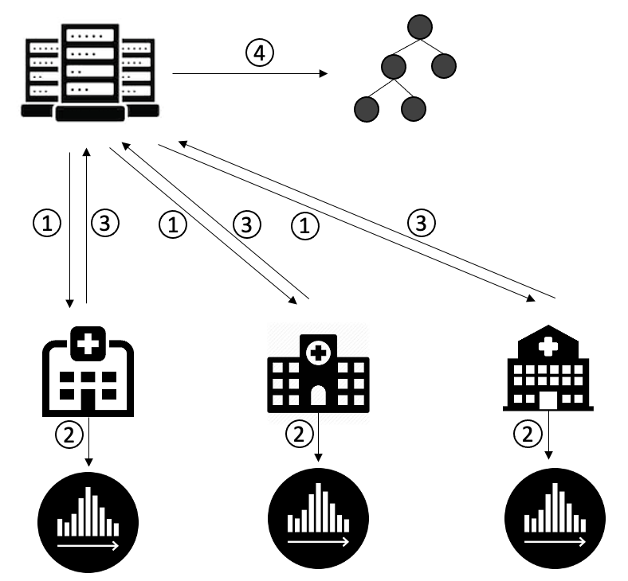
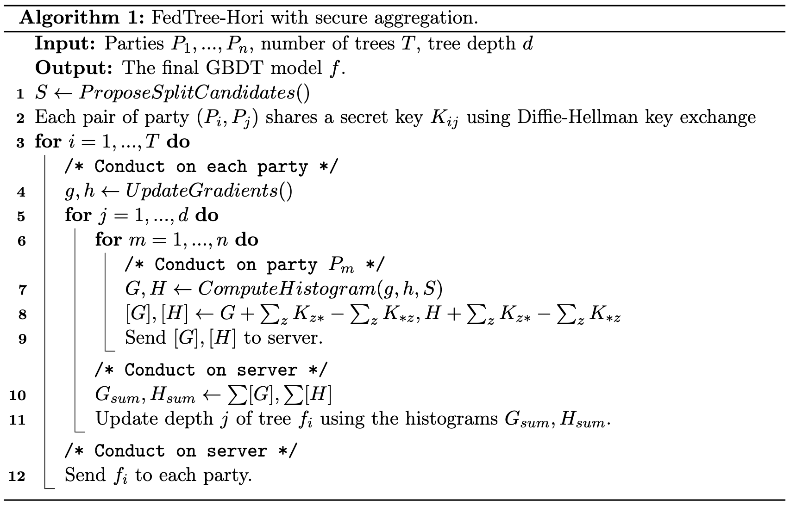
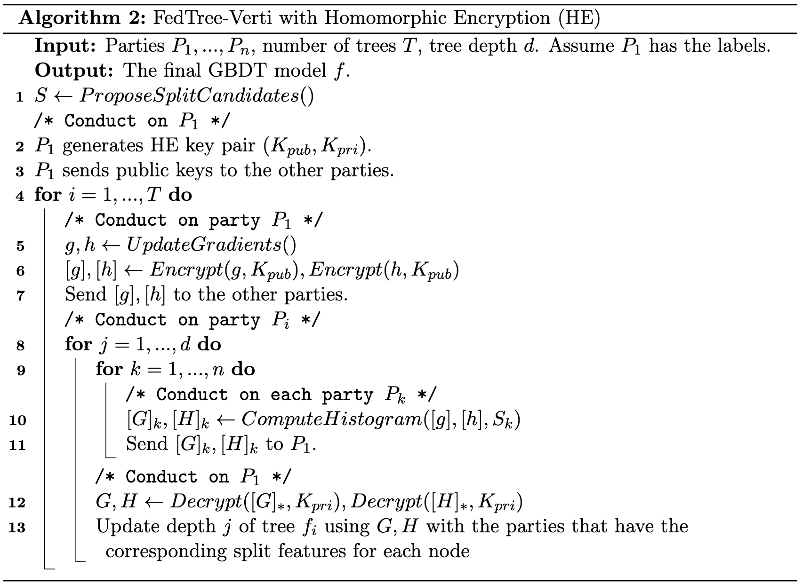

Frameworks
==========

Here is an introduction of FedTree algorithms.

**Contents**

-  `Horizontal Federated GBDTs <#horizontal-federated-gbdts>`__

-  `Vertical Federated GBDTs <#vertical-federated-gbdts>`__

-  `Build on Linux <#build-on-linux>`__

-  `Build on MacOS <#build-on-macos>`__

Horizontal Federated GBDTs
~~~~~~~~~~~~~~~~~~~~~~~~~~
In the horizontal FedTree, the parties have their local datasets with the same feature space but different sample spaces. The framework of horizontal federated GBDTs training is shown below. There are four steps in each round.

1. The server sends the initialization parameters (#round = 1) or sends the new tree (#round > 1) to the parties.

2. The parties update the gradient histogram.

3. The parties send the gradient histogram to the server.

4. The server merges the histogram and boosts a new tree.

We repeat the above steps until reach the given number of trees.

We provide the option to adopt the `secure aggregation <https://arxiv.org/pdf/1611.04482.pdf>`_ method to protect the exchanged histograms.
In the beginning of training, the clients and the server use Diffie-Hellman key exchange to share a secret key for each pair of clients.
Then, before transfering the gradient histogram, each client generates random noises for each other client, encrypts the noises by the shared key of the corresponding client, and sends the encrypted noises to the server.
Then, the server sends back the encrypted noises to the clients. The clients decrypts the noises with the shared keys. Then, the clients add the generated noises and subtract the decrypted noises to the local histogram.
The injected noises of each client cancel each other out and the aggregates histogram remains unchanged.

The detailed algorithm is shown below.

If adopting differential privacy, the server will train a differentially private tree in the fourth step using Laplace mechanism and exponential mechanism.

.. If adopting homomorphic encryption, the framework is shown below. There are five steps in each round.
    .. image:: ./images/hori_fram_he.png
   :align: center
   :target: ./images/hori_fram_he.png
    1. The server sends the initialization parameters and the public key (#round = 1) or sends the new tree (#round > 1) to the parties.
    2. The parties update the gradient histogram and encrypt it using the public key.
    3. The parties send the encrypted histogram to a selected party.
    4. The party sums the encrypted histogram and sends the merged histogram to the server.
    5. The server decrypts the histogram using its private key and boosts a new tree.

Vertical Federated GBDTs
~~~~~~~~~~~~~~~~~~~~~~~~
In the vertical FedTree, the parties have their local datasets with the same sample space but different feature spaces.
Moreover, at least one party has the labels of the samples. We specify one party that has the labels as the host party (i.e., aggregator).

The framework of vertical federated GBDTs training is shown below. There are four steps in each round.

.. image:: ./images/verti_fram.png
   :align: center
   :target: ./images/verti_fram.png

1. The host party (i.e., the party with the labels) updates the gradients and sends the gradients to the other parties.

For each depth:

2. The parties computes the local gradient histograms.

3. The parties send their local histograms to the host party.

4. The host party aggregate the histograms, computes the best split point, and ask the corresponding party (including itself) to update the node.

5. The parties send back the nodes to the host party.

Here 2-4 steps are done for each depth of a tree until reaching the given maximum depth. The above steps are repeated until reaching the given number of trees.
If homomorphic encryption is applied, the host party sends the encrypted gradients in the first step and decrypts the histogram in the fourth step.

We provide the option to adopt `additive homomorphic encryption <https://en.wikipedia.org/wiki/Paillier_cryptosystem>`_ to protect the exchanged gradients.
Specifically, the host party generates public and private keys before the training. Then, it uses the public key to encrypt the gradients before sending them.
After receiving local histograms from the parties, the host party uses privacy key to decrypt the histograms before further computation.

The detailed algorithm is shown below.

If differential privacy is applied, the host party updates the tree using Laplace mechanism and exponential mechanism.

