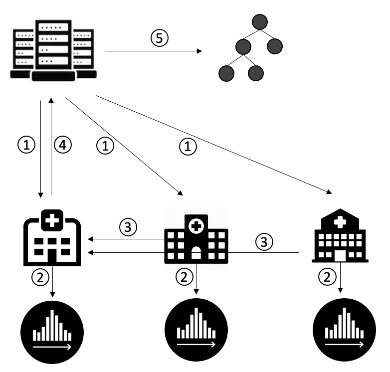

Frameworks
==========

Here is an introduction of FedTree algorithms.

**Contents**

-  `Horizontal Federated GBDTs <#horizontal-federated-gbdts>`__

-  `Vertical Federated GBDTs <#vertical-federated-gbdts>`__

-  `Build on Linux <#build-on-linux>`__

-  `Build on MacOS <#build-on-macos>`__

Horizontal Federated GBDTs
~~~~~~~~~~~~~~~~~~~~~~~~~~
The framework of horizontal federated GBDTs training is shown below. There are four steps in each round.

.. image:: ./images/hori_fram.png
   :align: center
   :target: ./images/hori_fram.png

1. The server sends the initialization parameters (#round = 1) or sends the new tree (#round > 1) to the parties.

2. The parties update the gradient histogram.

3. The parties send the gradient histogram to the server.

4. The server merges the histogram and boosts a new tree.

We repeat the above steps until reach the given number of trees.

If adopting differential privacy, the server will train a differentially private tree in the fourth step using Laplace mechanism and exponential mechanism.

If adopting homomorphic encryption, the framework is shown below. There are five steps in each round.

1. The server sends the initialization parameters and the public key (#round = 1) or sends the new tree (#round > 1) to the parties.

2. The parties update the gradient histogram and encrypt it using the public key.

3. The parties send the encrypted histogram to a selected party.

4. The party sums the encrypted histogram and sends the merged histogram to the server.

5. The server decrypts the histogram using its private key and boosts a new tree.

Vertical Federated GBDTs
~~~~~~~~~~~~~~~~~~~~~~~~

The framework of vertical federated GBDTs training is shown below. There are four steps in each round.

.. image:: ./images/verti_fram.png
   :align: center
   :target: ./images/verti_fram.png

1. The host party (i.e., the party with the labels) updates the gradients and sends the (encrypted) gradients to the other parties.

For each depth:

2. The parties computes the local gradient histograms.

3. The parties send their local histograms to the host party.

4. The host party decrypts the histograms (if needed) and updates the current depth of tree.

5. The host party sends the split information to the other parties.

Here 2-4 steps are done for each depth of a tree until reaching the given maximum depth. The above steps are repeated until reaching the given number of trees.
If homomorphic encryption is applied, the host party sends the encrypted gradients in the first step and decrypts the histogram in the fourth step.
If differential privacy is applied, the host party updates the tree using Laplace mechanism and exponential mechanism.

