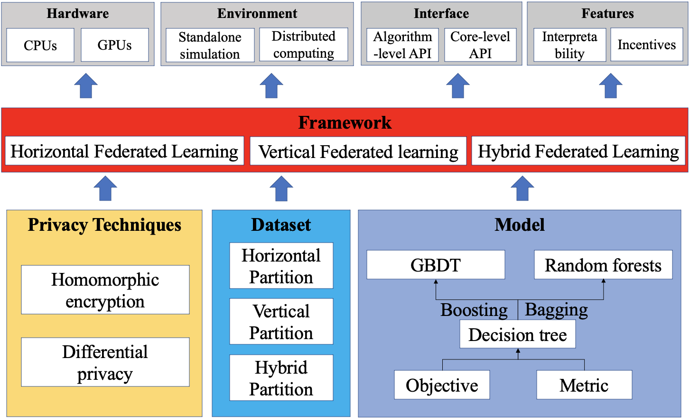

.. FedTree documentation master file, created by
   sphinx-quickstart on Mon Apr 19 14:22:49 2021.
   You can adapt this file completely to your liking, but it should at least
   contain the root `toctree` directive.

Welcome to FedTree's documentation!
===================================

**FedTree** is a federated learning system for tree-based models. It is designed to be highly **efficient**, **effective**,
and **secure**. It has the following features.

- Parallel computing on multi-core CPUs and GPUs.
- Stand-alone simulation and distributed learning.
- Support of homomorphic encryption, secure aggregation, and differential privacy.
- Federated training algorithms of gradient boosting decision trees and random forests.

.. toctree::
   :maxdepth: 1
   :caption: Contents:

      Installation <Installation>
      Quick Start <Quick-Start>
      APIs/Parameters <Parameters>
      Examples <Examples>
      Frameworks <Frameworks>
      Experiments <Experiments>

